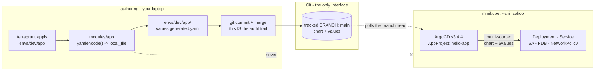

# hello-world on Kubernetes, via ArgoCD, configured by Terraform + Terragrunt

A Hello World web service running on minikube. ArgoCD reconciles it from Git; a
Terraform module, instantiated by Terragrunt, produces the configuration that ArgoCD
reads.

The interesting part of this exercise is not getting a container to serve text. It is
where the boundaries between the three tools sit, and whether the security posture
survives being poked at. Both are argued below, and both are checked by scripts rather
than asserted in prose.

---

## The one idea

Three tools, three jobs that do not overlap.

| Tool | Owns | Never does |
|---|---|---|
| **Terraform** (`modules/app`) | Turning typed, validated inputs into a rendered Helm values file | Talk to a cluster |
| **Terragrunt** (`root.hcl`, `envs/`) | Per-environment instantiation; DRY backend and version config | Contain resource logic |
| **ArgoCD** (`argocd/`) | Reconciling Git into the cluster | Read configuration from anywhere but Git |

Terraform writes to Git. ArgoCD reads from Git. They never meet.



The commit step is not friction to apologise for. It is the audit trail: every change
to what runs in the cluster arrives as a reviewable diff, and `git log` on one file
answers "what changed and when".

---

## Prerequisites

| Tool | Version used | Notes |
|---|---|---|
| minikube | >= 1.34 | Docker driver by default |
| kubectl | >= 1.31 | |
| Terraform | 1.9.x | `~> 1.9` is enforced |
| Terragrunt | >= 0.67 | Formatting command renamed in 0.78; the Makefile handles both |
| Helm | 3.16.x | Only needed for local linting; ArgoCD renders the chart itself |
| Docker | any recent | minikube's driver |

Kubernetes **v1.34.10** and ArgoCD **v3.4.4** are pinned in `scripts/bootstrap.sh`.

### If you forked this repository

The repo URL appears in three places, and ArgoCD will refuse the source if they do not
match your fork:

```
argocd/appproject.yaml    spec.sourceRepos[0]
argocd/application.yaml   spec.sources[0].repoURL
argocd/application.yaml   spec.sources[1].repoURL
```

---

## Running the project

### 1. Start the cluster

```bash
make up
```

Runs `scripts/bootstrap.sh`: starts (or reuses) a minikube profile with
`--cni=calico` and installs a pinned ArgoCD into it. Calico adds roughly 60-90
seconds to a first start - that is not a hang, and it is not optional (see
"NetworkPolicy, and the minikube trap" below). If a profile with this name
already exists but was created *without* Calico, the script fails loudly with a
`minikube delete --profile ... && make up` remediation rather than silently
running with an unenforced NetworkPolicy.

### 2. Render and deploy

```bash
make deploy
```

Runs `scripts/deploy.sh`: `terragrunt apply`s `envs/dev/app` to (re)render
`values.generated.yaml`, then applies `argocd/appproject.yaml` and
`argocd/application.yaml`. Before doing either, it refuses to proceed if:

- the generated values file is untracked, staged-but-uncommitted, or has
  unstaged edits,
- there are local commits not yet pushed to the branch ArgoCD tracks, or
- the two `targetRevision`s inside `application.yaml` disagree.

That is deliberate, not a bug: **ArgoCD syncs from a branch on the Git remote,
not from your working tree.** A change that only exists locally has changed
nothing about what is deployed.

### 3. Confirm it actually works

```bash
make verify
```

Runs `scripts/verify.sh` against the live cluster - see "What the checks
actually prove" below for the full list of what this asserts (not assumes).
Anything it can't check on every cluster (e.g. Calico's presence) reports
`WARN` rather than `FAIL`, since a tooling gap is not the same as a broken
control.

Reach the app directly:

```bash
kubectl -n hello-app port-forward svc/hello-app 8080:80
curl localhost:8080          # Hello World
curl localhost:8080/health   # {"status":"ok"}
```

Reach the ArgoCD UI:

```bash
kubectl -n argocd port-forward svc/argocd-server 8081:443
# https://localhost:8081, user: admin
kubectl -n argocd get secret argocd-initial-admin-secret \
  -o jsonpath='{.data.password}' | base64 -d; echo
```

Delete that secret once you've logged in and changed the password - see
"Security notes" below.

### 4. Iterate

Edit inputs in `envs/dev/app/terragrunt.hcl` (image, replicas, resources), then
repeat step 2. `make render` reruns just the Terraform half (no cluster
needed) if you want to inspect the generated values before committing them.

### 5. Tear down

```bash
make down
```

Runs `scripts/teardown.sh`: deletes the Application (its finalizer cascades to
everything it created) and the `hello-app` namespace, then deletes the
minikube profile. Set `KEEP_CLUSTER=1` to remove the Application/namespace but
leave the cluster running.

### Local checks that don't need a cluster

```bash
make render    # re-render envs/dev/app/values.generated.yaml only
make fmt       # terraform fmt + terragrunt hcl fmt
make lint      # everything CI checks: fmt/validate, helm lint/template,
               # kubeconform, yamllint, actionlint (last two skip with a
               # notice if not installed locally)
```

### Environment variables

Every script reads its knobs from environment variables with sensible
defaults, so nothing below is required - override only what you need to.

| Variable | Default | Used by | Meaning |
|---|---|---|---|
| `ENV_NAME` | `dev` | Makefile | Selects `envs/$(ENV_NAME)/app` for `render`/`lint`/`deploy`/`verify` |
| `MINIKUBE_PROFILE` | `hello-argocd` | bootstrap, teardown | minikube profile name |
| `MINIKUBE_DRIVER` | `docker` | bootstrap | minikube `--driver` |
| `K8S_VERSION` | `v1.34.10` | bootstrap | `--kubernetes-version` passed to minikube |
| `ARGOCD_VERSION` | `v3.4.4` | bootstrap | ArgoCD manifest tag installed |
| `APP_NAMESPACE` | `hello-app` | bootstrap, verify, teardown | Namespace the app is deployed into |
| `APP_NAME` | `hello-app` | deploy, verify, teardown | Name of the ArgoCD Application / Deployment |
| `ARGOCD_NAMESPACE` | `argocd` | verify | Namespace ArgoCD itself runs in |
| `KEEP_CLUSTER` | `0` | teardown | Set to `1` to leave the minikube profile running |

`ENV_NAME=staging make render` is how you'd target a second environment, once
one exists (see "Adding an environment" below).

---

## Layout

```
root.hcl                              Terragrunt root: backend, version constraints
modules/app/                          The Terraform module (+ its own README)
envs/dev/env.hcl                      Per-environment values (the environment name)
envs/dev/app/terragrunt.hcl           The unit: inputs for this env
envs/dev/app/values.generated.yaml    Rendered by Terraform, committed, read by ArgoCD
charts/hello-app/                     The Helm chart, with a values JSON schema
argocd/appproject.yaml                Scoped project (not "default")
argocd/application.yaml               Multi-source Application, branch-tracking
scripts/                              bootstrap, deploy, verify, teardown
.github/workflows/ci.yaml             Static checks
```

Adding an environment is copying `envs/dev` to `envs/staging`, changing `env.hcl`,
and editing the inputs. The module is untouched.

---

## Design decisions

It is a build artifact stored in Git, which normally deserves suspicion. It is here
because ArgoCD can only read Git. The alternatives are worse: have ArgoCD run
Terraform (a plugin, more moving parts, and Terraform now runs in the cluster), or
have a pipeline push the file (same commit, less visible). Committing it keeps a
single, greppable answer to "what is deployed".

The cost is that the file can go stale: nothing currently catches a committed
`values.generated.yaml` that no longer matches what `terragrunt apply` would render.

### Why ArgoCD is installed by a script, not by Terraform

Terraform could install ArgoCD with `helm_release`. Then Terraform would own the
GitOps controller that owns the applications, and a `terraform destroy` would take the
control plane with it. Keeping the bootstrap separate keeps the dependency in one
direction. It is also honest about what bootstrapping is: a one-off, imperative act
that happens before GitOps exists to manage anything.

### Why the Application uses `$values`

The chart lives in `charts/hello-app`; the values file lives in `envs/dev/app`. Helm
refuses `valueFiles` paths outside the chart directory, so a relative `../../` path
does not work in ArgoCD. The supported mechanism is a multi-source Application where
one source contributes no manifests and exists only to be referenced:

```yaml
sources:
  - repoURL: ...
    targetRevision: main
    ref: values          # contributes nothing; just a handle
  - repoURL: ...
    targetRevision: main
    path: charts/hello-app
    helm:
      valueFiles:
        - $values/envs/dev/app/values.generated.yaml
```

Both sources must name the same branch, for the reason given above.
`scripts/deploy.sh` reads every `targetRevision` in the manifest and refuses to
deploy if they ever diverge, so that invariant is enforced rather than remembered.

### Why a dedicated AppProject

ArgoCD's built-in `default` project allows any repository, any cluster, any namespace,
and any resource kind. An Application left in it means anyone who can write an
Application manifest can deploy anything anywhere. `argocd/appproject.yaml` restricts
this to one repo, one namespace, and the five kinds the chart actually renders, with
an empty `clusterResourceWhitelist`.

That empty list is why `scripts/bootstrap.sh` creates the `hello-app` namespace instead
of using ArgoCD's `CreateNamespace=true`: a Namespace is cluster-scoped infrastructure,
and allowing the Application to create cluster-scoped objects to save one line of
bootstrap would undo the point of scoping the project.

### Resource requests and limits

```yaml
requests: { cpu: 10m, memory: 64Mi }
limits:   { memory: 64Mi }          # note: no CPU limit
```

**Memory is incompressible.** A process that exceeds its memory cannot be slowed down,
only killed. Setting `limits.memory == requests.memory` makes memory failure
deterministic: a leak becomes a fast, local OOMKill of the offending pod rather than
node memory pressure that evicts innocent neighbours. (Note the QoS class is still
**Burstable**, not Guaranteed - Guaranteed would require a CPU limit equal to the CPU
request on every container, and the next paragraph is exactly why there is no CPU
limit here.)

**CPU is compressible**, so a CPU limit buys nothing here and costs something. Under the
CFS quota mechanism a container that hits its limit is throttled for the remainder of
each 100ms period, which shows up as latency spikes even on a node that is otherwise
idle. The CPU *request* is what the scheduler places on and what determines the share
under contention; that is the number that matters.

The honest counter-argument: on a shared, multi-tenant cluster a `LimitRange` will
often mandate a CPU limit, and "no CPU limit" is not a universal rule. The values are
configurable precisely so cluster policy can override the default.

### Probes

Three probes, all hitting `/health`, doing three different jobs:

- **startupProbe** - absorbs slow starts, so the liveness probe cannot kill a pod that
  is still booting. Without it, a liveness probe tuned for steady state has to be
  loosened enough to be useless.
- **readinessProbe** - gates Service endpoints. Fast and strict: this is what pulls a
  bad pod out of load balancing.
- **livenessProbe** - restarts a wedged process. Deliberately *slower* and more
  forgiving than readiness. An aggressive liveness probe is the classic way to turn a
  transient dependency blip into a cluster-wide restart storm.

### NetworkPolicy, and the minikube trap

**minikube's default CNI does not enforce NetworkPolicy.** A policy applied there is
accepted by the API server and appears in `kubectl get networkpolicy` - and does
nothing. A security control that silently does nothing is worse than no control,
because it looks like one.

So `scripts/bootstrap.sh` starts minikube with `--cni=calico` (this adds roughly 60-90
seconds to first start; it is not hung), and `scripts/verify.sh` checks that Calico is
present *before* it reports anything about the policy.

The policy is default-deny on **both** ingress and egress, then:

- ingress: the app port only
- egress: cluster DNS on UDP **and TCP** 53

The TCP half matters. DNS falls back to TCP for responses that do not fit in UDP, and
omitting it produces intermittent resolution failures that are genuinely unpleasant to
diagnose.

### Image pinning

```
hashicorp/http-echo:1.0@sha256:fcb75f691c8b0414d670ae570240cbf95502cc18a9ba57e982ecac589760a186
```

The Terraform module *rejects* any image reference without a digest. A tag is a mutable
pointer; pinning by digest is what makes "roll back to the previous version" mean
something. The tag is kept alongside for human readability.

This image is built on `gcr.io/distroless/static-debian12:nonroot`: no shell, no
package manager, nothing writable. That is what makes `readOnlyRootFilesystem: true`
and `runAsNonRoot` achievable rather than aspirational - and it is also why
`scripts/verify.sh` uses `kubectl debug` rather than `kubectl exec` to test egress.

One quirk worth knowing: http-echo shuts down gracefully on SIGTERM and then exits
with code 2. A normally-terminated pod therefore records a non-zero exit code in
`lastState`. It is not a crash.

### Local Terraform state

`root.hcl` writes state to `.terragrunt-state/` in the repo, so re-running `apply` is
idempotent rather than starting from scratch whenever the Terragrunt cache is cleared.
Local state is single-operator and has **no locking**; it is fine for a demo on one
laptop and wrong for anything shared.

---

## Security notes

- No secrets in this repository. Nothing here reads one.
- The repo is public, so ArgoCD needs no repository credentials. A private repo would
  need a repo secret in the `argocd` namespace - and that is the point where you want
  SOPS or External Secrets rather than a committed manifest.
- **Delete the initial admin secret** once you have logged in and changed the password.
  It is a cluster-admin credential sitting in plain text in etcd:
  ```bash
  kubectl -n argocd delete secret argocd-initial-admin-secret
  ```
- Reach the ArgoCD UI with `kubectl port-forward`. Do not expose it with a NodePort
  and `--insecure` to save a step.
- The workload runs non-root (UID 65532), with a read-only root filesystem, all
  capabilities dropped, `RuntimeDefault` seccomp, and **no ServiceAccount token
  mounted** - it makes no API calls, so a mounted token is pure blast radius.
- Tracking a branch means whoever can merge to it can deploy. That is the intended
  model, and it makes branch protection on the tracked branch a real security control,
  not a process nicety.

---

## What the checks actually prove

`make verify` fails, rather than warns, on each of:

- the ArgoCD Application is `Synced` and `Healthy`
- `targetRevision` is a real branch on the remote, not a tag, a pinned commit, or a
  ref that does not exist (only a genuinely unreachable remote downgrades this to a
  WARN, because a tooling gap is not a broken control)
- all replicas are Ready
- `runAsNonRoot`, `seccompProfile`, `readOnlyRootFilesystem`,
  `allowPrivilegeEscalation: false`, `capabilities.drop: [ALL]`, no token automount
- the running image is digest-pinned
- `GET /` returns `Hello World` and `GET /health` returns `{"status":"ok"}`
- Calico is present, so the NetworkPolicy is actually enforced
- an in-cluster request to the Service is allowed
- egress from inside an app pod to the internet is blocked

Worth doing by hand, because it is the most convincing twenty seconds here:

```bash
kubectl -n hello-app scale deploy/hello-app --replicas=5
kubectl -n hello-app get deploy hello-app -w
```

`selfHeal` reverts it. Git is authoritative, not merely aspirational.

## CI

`.github/workflows/ci.yaml` runs three jobs in parallel: Terraform fmt/validate and
Terragrunt hclfmt; `helm lint` + `helm template` + `kubeconform -strict` against the
v1.34.10 schemas; and yamllint + actionlint.

One deliberate choice there: **one third-party action** (`actions/checkout`), pinned
to a commit SHA rather than a tag, because a tag can be repointed at different code
and a SHA cannot. Every other tool is fetched by an explicit, version-pinned download.
(Pinning a CI action and tracking a Git branch for deploys are not in tension: one is
third-party code executing with repo access, the other is your own reviewed history.)

---

## What was verified, and what was not

Being precise about this, because "it works" is a claim.

**Verified by actually running it:**

- `terraform fmt -check -recursive`, `terraform validate`, `terragrunt hclfmt --check`
- `terragrunt apply` renders `values.generated.yaml`, and re-applying is a no-op
- the generated values validate against `charts/hello-app/values.schema.json` when
  merged over the chart defaults
- `shellcheck` and `bash -n` clean on all shell scripts; `yamllint` clean
- the image digest, the ArgoCD v3.4.4 manifest URL, Kubernetes v1.34.10 as current
  stable-1.34, and the kubeconform schema URL were each confirmed against upstream
- the committed `.terraform.lock.hcl` carries checksums for **all** provider platforms,
  not just the one it was generated on, so `terraform init` works on macOS and Windows

**Not verified, because it needs a cluster:**

- the end-to-end deploy: `make up`, `make deploy`, `make verify`. There was no container
  runtime available in the environment this was written in, so the chart has never been
  rendered by Helm nor applied to a real API server. The templates were checked by hand
  and against schemas; that is not the same as a green `make verify`.

Run `make up && make deploy && make verify` and the claim becomes a fact.

## What I would change for production

- Branch protection on the tracked branch, since merging to it is what deploys
- Remote state with locking (S3 + `use_lockfile`, available in Terraform 1.10+)
- SOPS or External Secrets, and ArgoCD repo credentials, once anything is private
- Image signing with cosign plus an admission policy that rejects unsigned images -
  digest pinning proves immutability, not provenance
- App-of-apps or an ApplicationSet once there is more than one environment, so the
  branch-per-environment mapping is declared once rather than per Application
- Ingress with TLS instead of `port-forward`
- A `kind`-based end-to-end job in CI. It was left out deliberately rather than shipped
  untested: kind, not minikube, is the right cluster for CI, and it needs a Calico
  install to make the NetworkPolicy meaningful there too.
